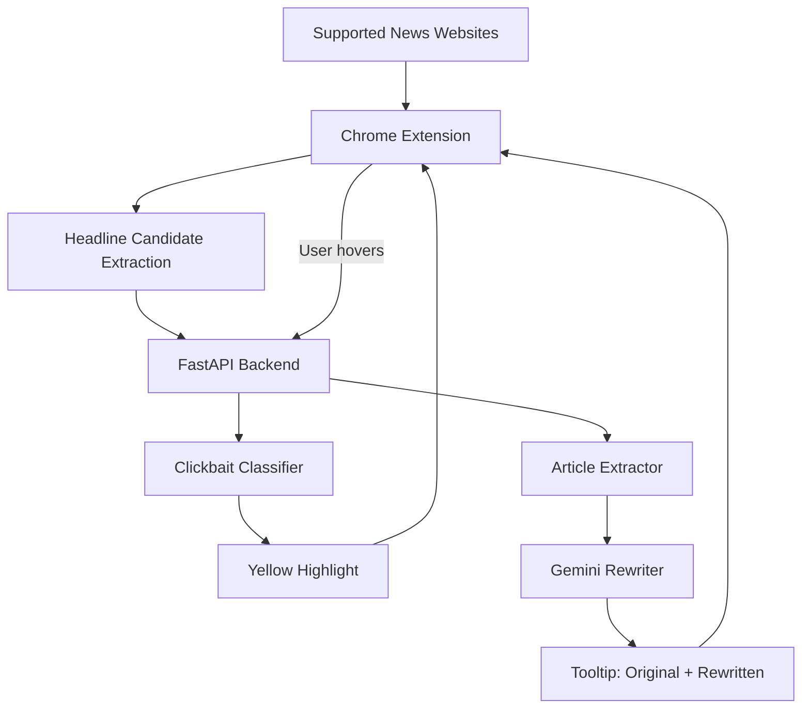

<a id="top"></a>

# ReBait: From Clickbait to Informed Choice

ReBait is a browser extension that helps readers make informed choices before clicking on news headlines. It detects potential clickbait and provides article-grounded headline suggestions on hover, while preserving the original headlines, links, and feed order.

📄 [Paper](https://dl.acm.org/doi/10.1145/3773078.3841264) · 🖼️ [Poster](assets/RecSys-Poster.pdf) · ▶️ [Web Demo & Video](https://rebait-recsys-demo.pages.dev/)

This repository contains the Chinese implementation for Taiwanese news websites. A separate English demo prepared for RecSys 2026 is available through the web demo and video linked above.

This project builds on a collaborative undergraduate research project supported by Taiwan’s NSTC Undergraduate Research Project program.

<details>
<summary><strong>Table of Contents</strong></summary>

- [Demo](#demo)
- [Architecture](#architecture)
- [Features](#features)
- [Tech Stack](#tech-stack)
- [Project Structure](#project-structure)
- [Running the Project](#running-the-project)
- [API Overview](#api-overview)
- [Evaluation](#evaluation)
- [Testing](#testing)
- [Limitations](#limitations)

</details>

## Demo

### English Demo — RecSys 2026

The English demo showcases ReBait on a curated feed of real news articles and on Upworthy. The web demo linked above includes an interactive replay using saved results and a video of the extension in use. No installation or API key is required to explore the replay.

### Chinese Website Examples

<details>
<summary>End-to-end workflow on Yahoo News Taiwan</summary>
    


</details>

<details>
<summary>UDN headline highlighting</summary>
    


</details>

<details>
<summary>ETtoday rewrite result</summary>
    


</details>

<details>
<summary>Extension popup</summary>


</details>

## Architecture

Overall workflow:

``` text
News website
→ Chrome Extension
→ FastAPI backend
→ Headline classification
→ Article extraction
→ Gemini rewrite
→ Highlight & tooltip display
```



## Features

-   Supports Yahoo News Taiwan, ETtoday, and UDN (Upworthy for English demo)
-   Detects and highlights clickbait-style headlines on supported news websites
-   Extracts article content from the original news page
-   Rewrites headlines with Gemini using article-level context
-   Shows live processing status and rewritten results in a tooltip
-   Control headline highlighting and hover-based rewriting from the popup

## Tech Stack

### Frontend

-   Chrome Extension Manifest V3
-   JavaScript
-   CSS

### Backend

-   Python
-   FastAPI
-   Pydantic
-   Trafilatura
-   Readability
-   BeautifulSoup
-   Hugging Face Transformers
-   Google Gemini API

## Project Structure

``` text
clickbait-rewriter/
├── assets/
├── backend/
│   ├── main.py         # FastAPI entry point
│   ├── config.py       # Configuration
│   ├── schemas.py      # Pydantic models
│   └── services/
│       ├── classifier.py
│       ├── article_extractor.py
│       └── rewriter.py
├── extension/
├── evaluation/         # Evaluation results
├── tests/              # Pytest test suite
├── requirements.txt
├── .env.example
└── README.md
```

## Running the Project

### Install Dependencies

``` bash
python -m venv .venv
source .venv/bin/activate
pip install -r requirements.txt
```

### Configure Environment Variables

Create a local `.env` file:

``` bash
cp .env.example .env
```

Fill in the required values:

``` env
CLASSIFIER_MODE=model
CLASSIFIER_MODEL_NAME=Stremie/xlm-roberta-base-clickbait

GEMINI_API_KEY=your_api_key_here
GEMINI_MODEL_NAME=gemini-2.5-flash-lite

CLICKBAIT_THRESHOLD=0.3
```

### Start the Backend

``` bash
python -m uvicorn backend.main:app --reload
```

Backend URLs:

``` text
http://127.0.0.1:8000/health
http://127.0.0.1:8000/docs
```

### Load the Chrome Extension

1.  Open `chrome://extensions/`
2.  Enable **Developer mode**
3.  Click **Load unpacked**
4.  Select the `extension/` folder

### Usage

Open a supported news website and hover over highlighted headlines to view rewritten versions generated from article-level context.

## API Overview

The FastAPI backend exposes four main endpoints:

``` text
GET  /health        # Check backend status
POST /api/classify  # Classify headline candidates
POST /api/extract   # Extract article content
POST /api/rewrite   # Rewrite headline with article context
```

Interactive API documentation is available at:

``` text
http://127.0.0.1:8000/docs
```

## Evaluation

Details are available in the `evaluation/` directory. These results apply to the Chinese implementation, not the English demo.

### Clickbait Classification

| Metric | Score |
|---|---:|
| Accuracy | 82.0% |
| Precision | 86.4% |
| Recall | 76.0% |
| F1 Score | 80.9% |

### Rewrite Quality

| Metric | Score |
|---|---:|
| Clarity | 4.84 / 5 |
| Informativeness | 4.44 / 5 |
| Faithfulness | 5.00 / 5 |
| Readability | 4.68 / 5 |
| Overall | 4.74 / 5 |

## Testing

Run all tests:

```bash
pytest
```

Current test status:

```text
28 passed
```

## Limitations

-   Article extraction quality depends on each website's HTML structure.
-   Gemini API quota may limit rewrite availability.
-   Generated rewrites may still require prompt tuning for different news categories.

<p align="right">
  <a href="#top">Back to top ↑</a>
</p>
